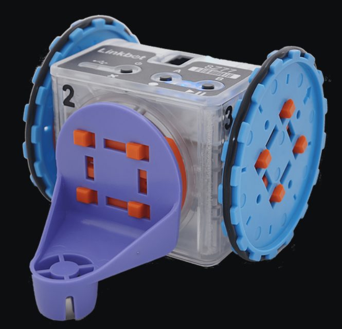

# Robot Documentation
</img>
___
## **Initalization:**
Using the simplified `Robot` is simple all you have to do is include the `robot.h` file into where you want to use it.
```cpp
#include <robot.h>
```
If you put the robot in a different folder/path, all you have to do is put the path to the `robot.h` file in.
**Example:**
```cpp
// robot.h is in the `include` folder
#include <include/robot.h>
```

Creating an instance of the robot class is also simple, it's done in the same way as the `CLinkbotI` class.
```cpp
Robot myRobotName;
```
After creating an instance of the robot class you have to *initalize* it so that it knows where it is, what direction it's facing, and the radius of it's wheels. You can do this by calling the `init` (short for *initalize*) method on the robot that you created.
```cpp
Robot robo;
robo.init(1, 5, 90, 1.75);
```
The first argument (aka parameter) of the `init` method is the robot's position on the **x-axis**, the second argument is the robot's position on the **y-axis**. The third parameter is the robot's inital rotation. Finally, the last argument is the radius of the wheels.
###### This is how the rotation works:

0&deg; Rotation:


90&deg; Rotation:


(et cetera)

## **The Basics:**
The first basic method of the Robot class is `drive`.
```cpp
Robot robo;
robo.drive(11.5);
```
The first and only argument of drive is the distance to drive, in inches. If the distance is negative then the robot will drive backwards.

Another basic method is `turn`.
```cpp
Robot robo;
robo.turn(90);
```
Its first and only argument is the angle in degrees to turn. If the argument is positive, then the robot will turn right, if the argument is negative, then the robot will turn left.

The next simple method is `driveShape`
```cpp
Robot robo;
robo.driveShape(TRIANGLE, 10);
```
The first argument to the `driveShape` method is the shape type. It supports all shapes from triangle to decagon, **the shape name must be in caps**. Circles are also supported. The second argument is the side length of the shape that you want the robot to drive, or if you want to draw a circle, the circumferce. **IMPORTANT! THE CIRCUMFERENCE OF A CIRCLE CANNOT BE LESS THAN 2!**

## **Intermediate:**
*These are the methods that you will probably use less often, and are a bit more challenging to use and understand.*

The first, and simplest method you'll find in this section is `driveTo`.
```cpp
Robot robo;
robo.driveTo(3, 7);
```
The first argument is the *x-coordinate* that you want the robot to travel to, the second argument is the *y-coordinate* that you want the robot to travel to.